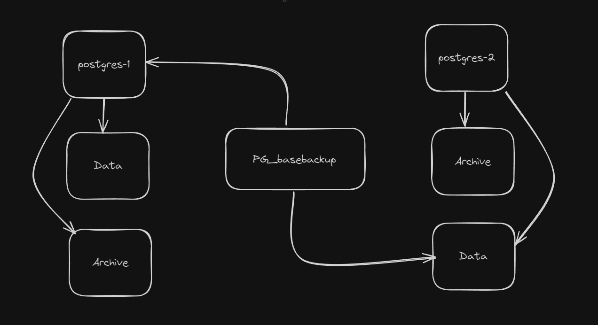

<h3>Postgres replication</h3>
<p> gambaran konsep </p>




<p> upload file docker-compose dan jalankan </p>

```
docker-compose up -d
```
<p> masuk ke console postgres-1 </p>

```
docker exec -it postgres-1 bash
```

<p> buat akun baru di dalam container postgres-1 dengan nama replicationUser: </p>

```
createuser -U postgresadmin -P -c 5 --replication replicationUser
exit
```

<p> list network yang ada </p>

```
docker network ls
```

<p> cek network yang digunakan oleh container postgres-1 dan postgres-2 </p>

```
docker network inspect postgres-replikasi-sami_postgres
```

<p> buat backup </p>

```
docker run -it --rm `
--net postgres-replikasi-sami_postgres `
-v ${PWD}/postgres-2/pgdata:/data `
--entrypoint /bin/bash postgres:15.0 `
```

<p> catatan : --net postgres-replikasi-sami_postgres ` adalah network yang digunakan oleh container postgres-1 dan postgres-2 </p>

```
pg_basebackup -h postgres-1 -p 5432 -U replicationUser -D /data/ -Fp -Xs -R
```

<p> jika terjadi error "pg_basebackup: error: directory "/data/" exists but is not empt" maka hapus folder data terlebih dahulu </p>

```
rm -rf /data/*
```
<p> lakukan tes replikasi </p>
<p> masuk ke dalam container postgres-1 </p>

```
docker exec -it postgres-1 bash
```

<p> masuk ke dalam database </p>

```
psql --username=postgresadmin postgresdb
```
<p> buat table </p>

```
CREATE TABLE customers (firstname text, customer_id serial, date_created timestamp);
```

<p>tampilkan the table </p>

```
\dt
```

<p> masuk ke dalam container postgres-2 </p>
```
docker exec -it postgres-2 bash
```

<p> login to postgres </p>

```
psql --username=postgresadmin postgresdb
```

<p> tampilkan the tables </p>

```
\dt
```
<p> tralala </p>
<p> semoga bermafaat </p>